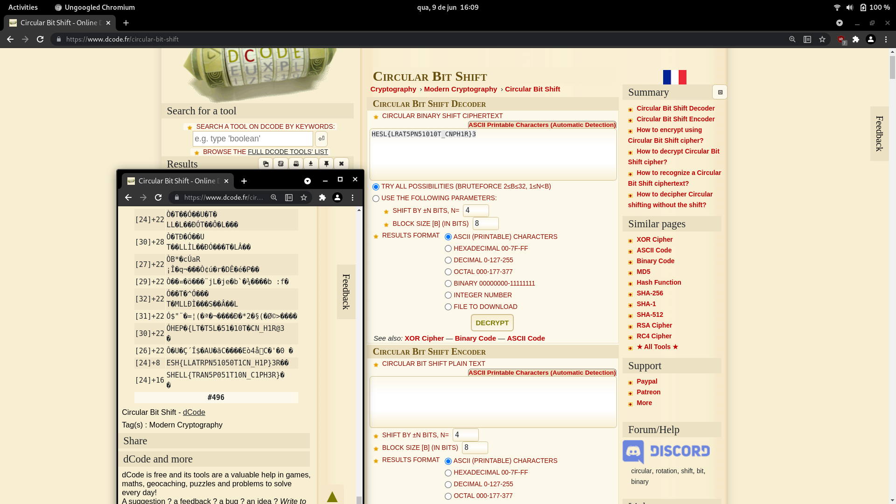

# Algoric-Shift
###### Cryptography - 50 points

```
HESL{LRAT5PN51010T_CNPH1R}3
```

Using Circular Bit Shift on dcode.fr with the bruteforce option selected its possible to decipher the flag.



```
SHELL{TRAN5P051T10N_C1PH3R}
```

### Attachments
[dcode.fr - Circular Bit Shift](https://www.dcode.fr/circular-bit-shift)
###### 2021 - methane4