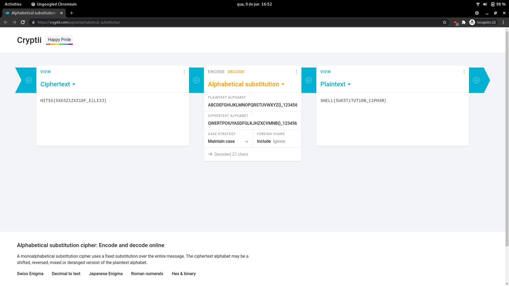

# Subsi
###### Cryptography - 50 points

```
HITSS{5X65Z1ZXZ10F_E1LI3J}
```


```
alpha = 'ABCDEFGHIJKLMNOPQRSTUVWXYZ{}_1234567890'
key   = 'QWERTPOIUYASDFGLKJHZXCVMNB{}_1234567890'

text = <flag>

def encrypter(text,key):
    encrypted_msg = ''
    for i in text:
        index = alpha.index(i)
        encrypted_msg += key[index]
    # print(encrypted_msg)
    return encrypted_msg
```

Using the alphabet and the key on a substitution cipher tool the flag is deciphered. 



```
SHELL{5U65T1TUT10N_C1PH3R}
```

### Attachments
[Cryptii - Alphabetical Substitution](https://cryptii.com/pipes/alphabetical-substitution)
###### 2021 - methane4