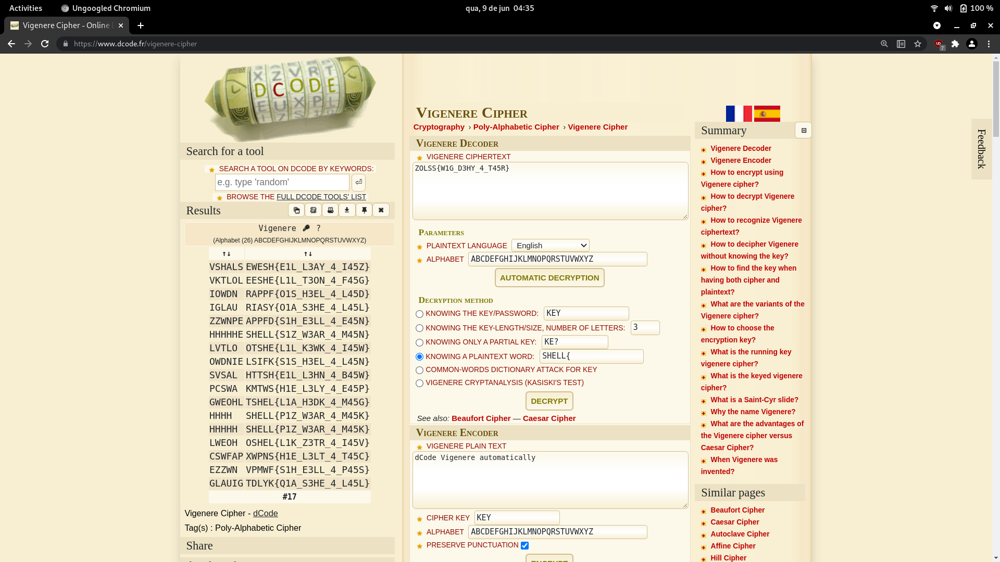

# encoder
###### Cryptography - 50 points

```
can you decrypt this text : "ZOLSS{W1G_D3HY_4_T45R}"
```

Using the Vigenere Cipher with the known word option selected i was able to decode the flag.



```
SHELL{P1Z_W3AR_4_M45K}
```

### Attachments
[dcode.fr - Vigenere Cipher](https://www.dcode.fr/vigenere-cipher)
###### 2021 - methane4