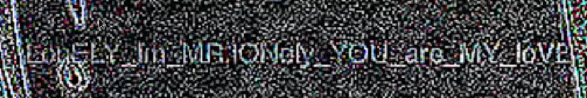

# Grass is green
###### Forensics - 200 points
For this challenge we were provided with an [image](grass_is_green.jpg) to analyse.

I ran [stegsolve](https://github.com/eugenekolo/sec-tools/tree/master/stego/stegsolve/stegsolve) and was able to view the flag. Alternatively i recommend using another tool like [stegonline](https://stegonline.georgeom.net/upload), stegsolve's ui is not very good and you cant zoom either.



```
LonELY_Im_MR.lONely_YOU_are_MY_loVE
```

### Attachments
[grass_is_green.jpg](grass_is_green.jpg)
###### 2021 - methane4