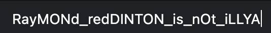

# Hidden inside 2
###### Forensics - 157 points
For this challenge we were provided with an [image](HIDDEN_INSIDE_2.jpg) to analyse.

I ran [stegoveritas](https://github.com/bannsec/stegoVeritas) to perform various tests and it was able to extract a file containing the flag



```
SHELL{RayMONd_redDINTON_isNOt_iLLYA}
```

### Attachments
[HIDDEN_INSIDE_2.jpg](HIDDEN_INSIDE_2.jpg)
###### 2021 - methane4