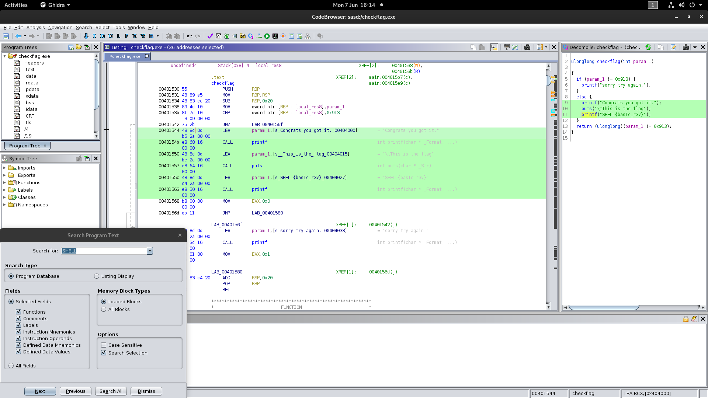

# check_flag
###### Reverse Engineering - 50 points
For this challenge we were provided with an [executable](checkflag.exe) to analyse. I used [Ghidra](https://ghidra-sre.org/) to decompile it, as a first step i searched for a string in the flag's format and i found the flag.

```
SHELL{bas1c_r3v}
```


### Attachments
[checkflag.exe](checkflag.exe)
###### 2021 - methane4