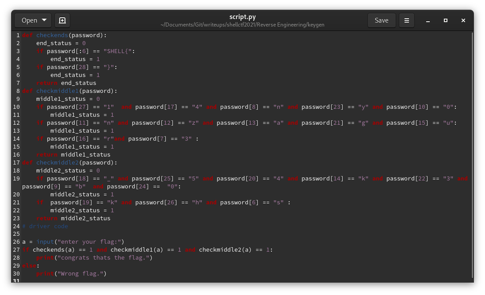

# keygen
###### Reverse Engineering - 80 points
For this challenge we were provided with a [python script](script.py). I was able to reconstruct the flag by typing it according to `password[27] == "1" (password[characterposition] == "caracter")`

```
SHELL{s3nb0nzakur4_k4g3y05h1}
```


### Attachments
[script.py](script.py)
###### 2021 - methane4