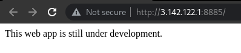
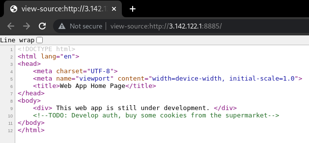

# Under Development
###### Forensics - 200 points

For this challenge we were provided with an [url](http://3.142.122.1:8885/) to visit.



Investigating the source code we found a comment with the mention of cookies.



The value is base64 encoded, decoding it shows the value `user`. Changing the value to admin, encoding it back to base64 and editing the cookie the webpage shows the flag.


```
SHELL{0NLY_0R30_8e1a91a632ecaf2dd6026c943eb3ed1e}
```

### Attachments
[http://3.142.122.1:8885/](http://3.142.122.1:8885/)
###### 2021 - methane4