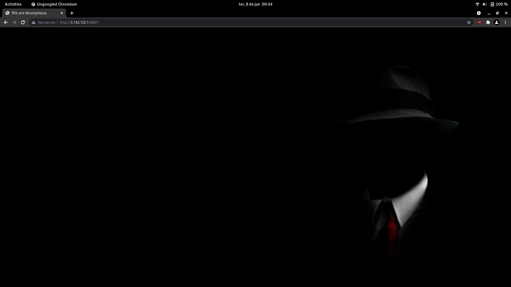
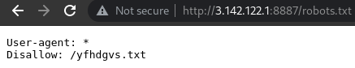
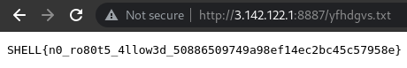

# anonym
###### Web Security - 50 points
For this challenge we were provided with a [url](http://3.142.122.1:8887) to visit. 



I found that it has a robots.txt



Following the path from the robots.txt the flag is displayed.



```
SHELL{n0_ro80t5_4llow3d_50886509749a98ef14ec2bc45c57958e}
```


### Attachments
[http://3.142.122.1:8887](http://3.142.122.1:8887)
###### 2021 - methane4