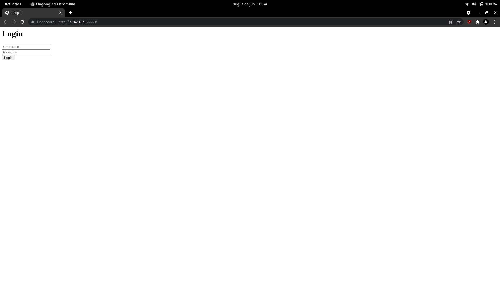
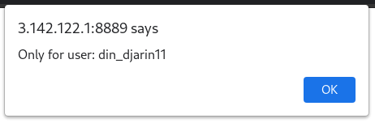
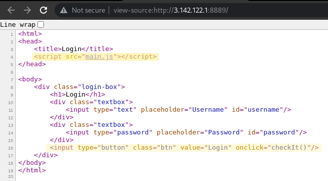
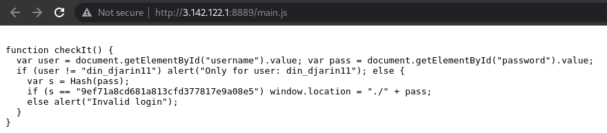
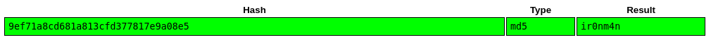

# login
###### Web Security - 50 points
For this challenge we were provided with a [url](http://3.142.122.1:8889/) to visit. 



Visting the webpage and trying a standard login we receive a message with the mention of a possible username.



Seeing that the message was client-sided i took a look at the source code. I found a javascript file and a function named `checkIt()` being run when using the login button.



When looking at the `checkIt()` function i found a hashed password.



 I entered it on crackstation and got a result.




After that i used it to log in and a file was downloaded containing the flag.


```
SHELL{th1s_i5_th3_wa7_845ad42f4480104b698c1e168d29b739}
```


### Attachments
[http://3.142.122.1:8889/](http://3.142.122.1:8889/)

[challenge source code](https://github.com/sh3llpwn/SHELLCTF_2021/tree/main/Web/login)